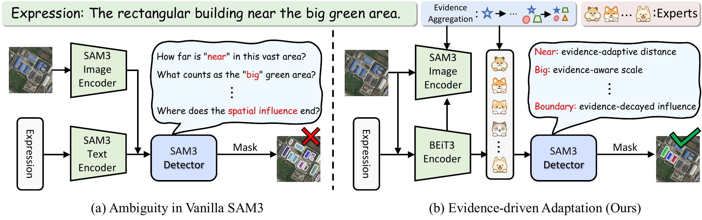
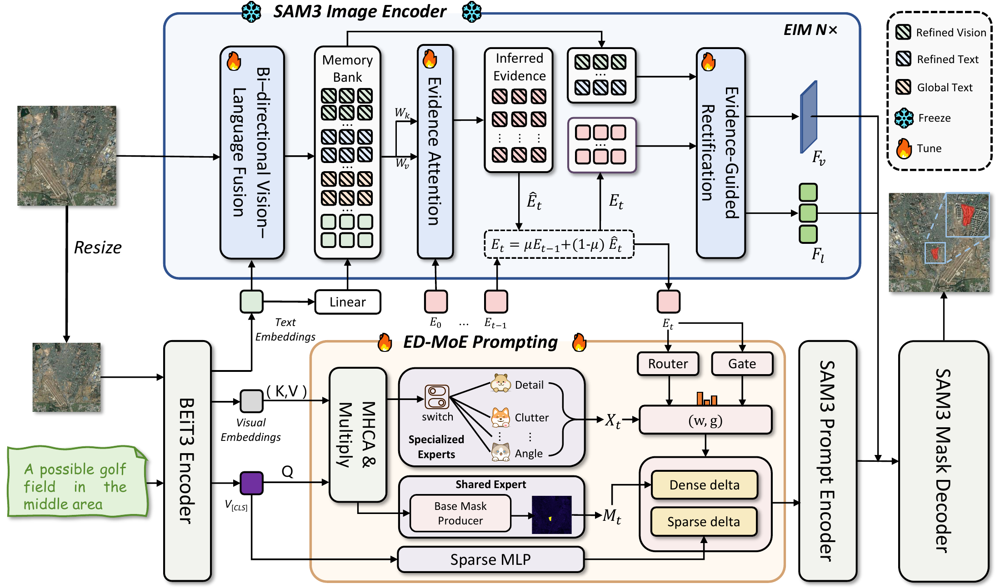
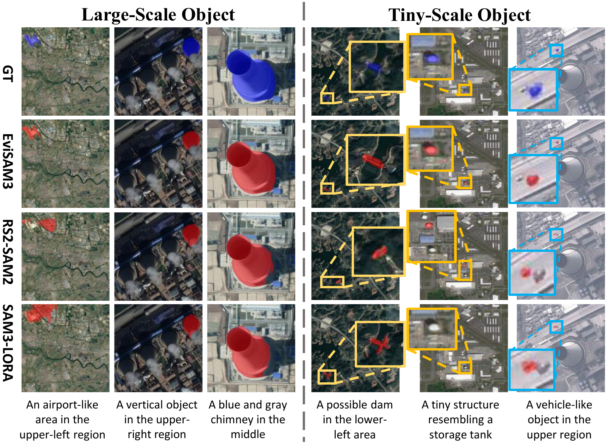

<p align="center">
  
</p>

<h1 align="center" id="evisam3">EviSAM3</h1>

<p align="center">
  <strong>Evidence-Driven SAM3 for Referring Remote Sensing Image Segmentation</strong>
</p>

<p align="center">
  
  <a href="docs/EviSAM3.pdf"></a>
  <a href="#getting-started"></a>
  <a href="#license"></a>
</p>

<p align="center">
  <a href="mailto:wiyhduan@mail.scut.edu.cn">Yuhang Duan</a><sup>1,2,*</sup> &nbsp;·&nbsp;
  <a href="mailto:wxs@mail.dlut.edu.cn">Xiaoshuai Wu</a><sup>1,*</sup> &nbsp;·&nbsp;
  <a href="mailto:zhangcq23@mails.tsinghua.edu.cn">Chengqi Zhang</a><sup>3</sup><br>
  <a href="mailto:lujc22@mails.tsinghua.edu.cn">Jincheng Lu</a><sup>4</sup> &nbsp;·&nbsp;
  Mingwei Zhang<sup>5</sup> &nbsp;·&nbsp;
  <a href="mailto:yuliu@dlut.edu.cn">Yu Liu</a><sup>1,†</sup>
</p>

<p align="center">
  <sup>*</sup> Equal contribution &nbsp;&nbsp; <sup>†</sup> Corresponding author
</p>

<details>
<summary><strong>Author affiliations</strong></summary>

1. School of Software Technology, Dalian University of Technology, Dalian, China
2. Shien-Ming Wu School of Intelligent Engineering, South China University of Technology, Guangzhou, China
3. Department of Energy and Power Engineering, Tsinghua University, Beijing, China
4. Department of Engineering Physics, Tsinghua University, Beijing, China
5. School of Computer Science and Technology, Dalian University of Technology, Dalian, China

</details>

<p align="center">
  <a href="#overview">Overview</a> &nbsp; / &nbsp;
  <a href="#method">Method</a> &nbsp; / &nbsp;
  <a href="#results">Results</a> &nbsp; / &nbsp;
  <a href="#getting-started">Getting started</a> &nbsp; / &nbsp;
  <a href="#citation">Citation</a>
</p>

---

## Overview

**Segment the object described in words, even when the scene makes the reference ambiguous.**

Referring remote sensing image segmentation takes an overhead image and a natural language expression as input, and predicts the mask of the referred target. Descriptions such as *“the rectangular building near the big green area”* require spatial and contextual reasoning across objects with different scales and orientations.

EviSAM3 adapts SAM3 through **progressive evidence integration** and **evidence-driven expert prompting**. Visual and linguistic cues accumulate across backbone layers, then guide specialized experts to refine segmentation prompts.

<p align="center">
  
</p>

| Progressive evidence | Specialized experts | Foundation model adaptation |
| :--- | :--- | :--- |
| Integrate visual and linguistic cues through a momentum-updated evidence memory. | Route evidence to experts for details, elongated structures, and clutter. | Retain the SAM3 visual backbone while learning adapters and prompt refinements. |

## Method

<p align="center">
  
</p>

### Evidence Integration Module · EIM

A BEiT3 encoder provides a multimodal prior. Evidence Rectified Adapters introduce cross-modal interactions into the SAM3 image encoder, infer new evidence, and combine it with the evidence memory through momentum updates. The accumulated evidence progressively rectifies intermediate representations.

### Evidence-Driven Mixture-of-Experts · ED-MoE

The accumulated evidence controls expert routing and prompt refinement. A shared expert provides a base prediction, while three specialized experts contribute complementary cues:

| Expert | Focus | Implementation |
| :--- | :--- | :--- |
| **Detail** | Local structures and boundaries | Depthwise convolution |
| **Elongated** | Orientation-sensitive, elongated targets | Adaptive Rotated Convolution |
| **Clutter** | Target discrimination in complex backgrounds | Normalization and pointwise convolution |

Their outputs refine dense and sparse prompts for mask decoding.

**Core implementation:** [model](models/evf_sam3.py) · [evidence and expert modules](lib/evf_modules.py) · [rotated convolution](arc/adaptive_rotated_conv.py).

## Results

All values below are **percentages reported in the paper**. Higher is better.

### Benchmark performance

| Dataset | Split | Pr@0.5 | Pr@0.9 | oIoU | mIoU |
| :--- | :--- | ---: | ---: | ---: | ---: |
| RRSIS-D | Validation | 83.45 | 32.36 | 81.38 | 71.25 |
| **RRSIS-D** | **Test** | **82.81** | **30.82** | **80.27** | **70.65** |
| RefSegRS | Validation | 98.14 | 83.53 | 92.44 | 91.32 |
| **RefSegRS** | **Test** | **89.93** | **45.95** | **86.51** | **80.56** |

### Comparison on test splits

| Method | RRSIS-D mIoU | RefSegRS mIoU |
| :--- | ---: | ---: |
| RMSIN | 64.20 | 62.58 |
| SAM3-LoRA | 59.81 | 58.11 |
| SAM3-Adapter | 63.39 | 58.54 |
| RS2-SAM2 | 66.72 | 73.90 |
| **EviSAM3** | **70.65** | **80.56** |
| **Gain over RS2-SAM2** | **+3.93 points** | **+6.66 points** |

**Metrics:** Pr@t is the percentage of predictions with IoU above t; mIoU averages sample IoUs; oIoU divides total intersection by total union. See the [evaluation protocol](docs/REPRODUCTION.md#evaluation-protocol) before comparing script outputs with these tables.

### Qualitative comparison

<p align="center">
  
</p>

<p align="center">
  <sub>Examples from the paper covering large targets, tiny structures, and ambiguous referring expressions. Ground truth is blue; predictions are red.</sub>
</p>

## Getting started

The training and evaluation entrypoints use **Linux, NVIDIA CUDA, and NCCL**. Paper experiments use **4 NVIDIA H200 GPUs**, a batch size of **4 per GPU**, and **60 epochs**.

### 1. Clone and prepare the environment

```bash
git clone https://github.com/YaofireJinglian/EviSAM3.git
cd EviSAM3
```

Follow the [environment setup](docs/REPRODUCTION.md#environment) for SAM3, BEiT3, and the additional project dependencies. The original requirements file contains legacy version pins; consult the setup notes when using the newer SAM3 environment.

### 2. Prepare datasets and pretrained weights

| Resource | Source | Configuration |
| :--- | :--- | :--- |
| **RRSIS-D** | [Official RMSIN repository](https://github.com/Lsan2401/RMSIN) | [RRSIS-D config](configs/rrsisd-evf-sam3.yaml) |
| **RefSegRS** | [Official RRSIS repository](https://github.com/zhu-xlab/rrsis) · [Dataset](https://huggingface.co/datasets/JessicaYuan/RefSegRS) | [RefSegRS config](configs/refsegrs-evf-sam3.yaml) |
| **SAM3** | [Official repository](https://github.com/facebookresearch/sam3) · [Weights](https://huggingface.co/facebook/sam3) | `sam_checkpoint` |
| **BEiT3 Large** | [Official BEiT3 repository](https://github.com/microsoft/unilm/tree/master/beit3) | `encoder_pretrained` |
| **BEiT3 tokenizer** | [Official tokenizer instructions](https://github.com/microsoft/unilm/tree/master/beit3#text-tokenizer) | `beit3_spm` |

Replace **every** `${DATA_ROOT}` and `${CKPT_ROOT}` occurrence in the selected YAML file with your actual paths, including entries inside `model.args` and the dataset sections. These entrypoints read YAML paths literally.

Dataset layouts, checkpoint filenames, the original `datasets` module, and output path setup are documented in the [preparation guide](docs/REPRODUCTION.md#data-and-weights).

### 3. Train

Once the environment and paths are configured:

```bash
# RRSIS-D: four GPUs
CUDA_VISIBLE_DEVICES=0,1,2,3 torchrun --standalone --nproc_per_node=4 \
  train_evf.py \
  --config configs/rrsisd-evf-sam3.yaml \
  --name rrsisd_evfsam3

# RefSegRS: four GPUs
CUDA_VISIBLE_DEVICES=0,1,2,3 torchrun --standalone --nproc_per_node=4 \
  train_evf.py \
  --config configs/refsegrs-evf-sam3.yaml \
  --name refsegrs_evfsam3
```

Use `--resume /absolute/path/to/model_epoch_last.pth` to resume training. The entrypoint saves `model_epoch_last.pth` and `model_epoch_best.pth`; see [output paths](docs/REPRODUCTION.md#output-paths) for their location.

### 4. Evaluate

```bash
CUDA_VISIBLE_DEVICES=0 torchrun --standalone --nproc_per_node=1 \
  test_evf.py \
  --config configs/rrsisd-evf-sam3.yaml \
  --checkpoint /absolute/path/to/model_epoch_best.pth \
  --split test
```

For RefSegRS, use `configs/refsegrs-evf-sam3.yaml`. Set `--split val` for validation.

The paper tables and the current standalone evaluator use different threshold aggregation; see the [evaluation protocol](docs/REPRODUCTION.md#evaluation-protocol). Trained EviSAM3 weights are not bundled with this repository.

## Repository guide

```text
EviSAM3/
├── arc/                       # Adaptive Rotated Convolution
├── configs/                   # Dataset and model configurations
├── datasets/                  # Dataset registry, loaders, and wrappers
├── docs/                      # Paper, figures, and preparation guide
├── lib/
│   ├── evf_modules.py         # Evidence rectification and expert prompting
│   └── unilm/                 # BEiT3 and TorchScale components
├── models/
│   ├── evf_sam3.py            # EviSAM3 model
│   └── sam3/                  # SAM3 components
├── refer/                     # REFER annotation interface
├── scripts/                   # Baselines, ablations, and visualizations
├── train_evf.py               # Distributed training
└── test_evf.py                # Distributed evaluation
```

The original code package includes `datasets/`. If it is absent from a fresh Git checkout, see the [source module note](docs/REPRODUCTION.md#dataset-source-module).

<details>
<summary><strong>Analysis and visualization tools</strong></summary>

| Tool | Purpose |
| :--- | :--- |
| [`eval_sam3_baseline.py`](scripts/eval_sam3_baseline.py) | Evaluate the SAM3 baseline |
| [`eval_ablation.py`](scripts/eval_ablation.py) | Evaluate model ablations |
| [`visualize_strength_map.py`](scripts/visualize_strength_map.py) | Analyze gains by object scale and query length |
| [`visualize_text_saliency.py`](scripts/visualize_text_saliency.py) | Visualize textual cue saliency |
| [`visualize_token_umap.py`](scripts/visualize_token_umap.py) | Inspect token representations |

Use the Python entrypoints with explicit paths. Some shell wrappers contain machine-specific environment variables.

</details>

## Citation

If you use EviSAM3 in your research, please cite:

```bibtex
@inproceedings{duan2026evisam3,
  title     = {{EviSAM3}: Evidence-Driven {SAM3} for Referring
               Remote Sensing Image Segmentation},
  author    = {Duan, Yuhang and Wu, Xiaoshuai and Zhang, Chengqi
               and Lu, Jincheng and Zhang, Mingwei and Liu, Yu},
  booktitle = {Advances in Neural Information Processing Systems},
  year      = {2026}
}
```

## Acknowledgements

We thank the developers of [SAM3](https://github.com/facebookresearch/sam3), [BEiT3 / UNILM](https://github.com/microsoft/unilm/tree/master/beit3), and the RRSIS benchmark datasets for their publicly available resources. Original copyright notices are retained in the corresponding source files.

## License

Project code is covered by the repository's [MIT license](LICENSE), subject to the scope of that license. Bundled third-party components retain their original terms, including the [SAM license](models/LICENSE). Pretrained weights and datasets follow the licenses supplied by their respective providers.

## Contact

For questions about the paper: [Yuhang Duan](mailto:wiyhduan@mail.scut.edu.cn) or [Yu Liu](mailto:yuliu@dlut.edu.cn). For code questions, please [open an issue](https://github.com/YaofireJinglian/EviSAM3/issues).

<p align="right"><a href="#evisam3">Back to top ↑</a></p>
